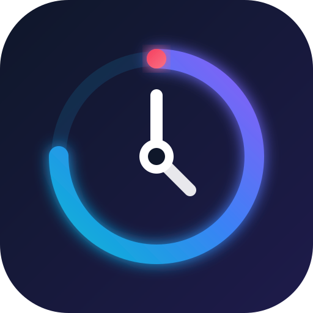

# ChronoPulse

```
yarn add -D tailwindcss @tailwindcss/vite vite sharp
```

<div align="center">

  <!-- Logo -->
  

  <h1>ChronoPulse</h1>

  <p>
    <b>A modern, high-performance Chrome countdown timer extension built with Tailwind CSS v4, WXT, and React.</b>
  </p>

  <!-- Badges -->
  <p>
    <a href="https://github.com/facebook/react"></a>
    <a href="https://tailwindcss.com"></a>
    <a href="https://wxt.dev"></a>
    <a href="LICENSE"></a>
  </p>

</div>

---

## 📖 Introduction

**ChronoPulse** is a lightweight and aesthetically pleasing Chrome extension designed for developers, creators, and productivity enthusiasts. Built on a modern Web Extensions stack, it delivers instant startup times, zero lag, and a slick glassmorphic UI. Whether you're managing Pomodoro focus sessions, tracking meeting durations, or setting quick reminders, ChronoPulse keeps your time in check.

## ✨ Features

- ⏱️ **Precision Countdown & Alarms**: Instant presets or custom second-accurate timers.
- 🎨 **Tailwind CSS v4 Driven UI**: Modern dark-mode aesthetics with vibrant gradients and smooth visuals.
- 🔔 **System Notifications**: Crisp audio cues and native desktop alerts when timers complete.
- ⚡ **WXT Architecture**: Next-gen Web Extension framework ensuring minimal memory footprint and lightning-fast popups.
- 📱 **Adaptive Design**: Responsive UI that scales seamlessly across extension popups and dedicated options pages.

## 🛠️ Tech Stack

* **UI Framework**: [React](https://react.dev/)
* **Styling Engine**: [Tailwind CSS v4](https://tailwindcss.com/)
* **Extension Framework**: [WXT (Web Extension Tools)](https://wxt.dev/)
* **Iconography**: Custom Scalable Vector Graphics (SVG)

## 🚀 Getting Started

### Prerequisites

Ensure you have the following installed locally:
- Node.js >= 18.0.0
- pnpm / npm / yarn

### Local Development

1. **Clone the repository**
   ```bash
   git clone [https://github.com/your-username/chronopulse.git](https://github.com/your-username/chronopulse.git)
   cd chronopulse