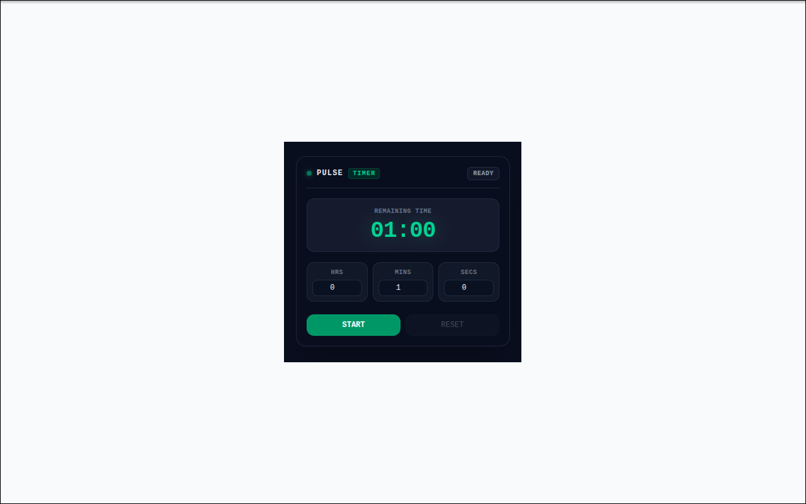

 <div align="center">
  
</div>

<div align="center">
  

  <h1>PulseTimer</h1>

  <p>
    <b>A sleek, minimalist countdown timer & alarm Chrome extension for focus, productivity, and everyday tasks.</b>
  </p>

  <p>
    <a href="https://github.com/facebook/react"></a>
    <a href="https://tailwindcss.com"></a>
    <a href="https://wxt.dev"></a>
    <a href="LICENSE"></a>
  </p>

</div>

---

## 📖 Introduction

**PulseTimer** is a lightweight, distraction-free countdown timer and alarm extension designed for developers, creators, and anyone who wants a simple way to stay focused.

Set a timer directly from your browser and let PulseTimer handle the countdown in the background. Whether you're working through a focused session, timing a break, or setting a quick reminder, PulseTimer keeps the experience simple and reliable.

Built with a modern Web Extensions stack, PulseTimer combines a minimal interface with reliable background timing and multiple notification channels.

## ✨ Key Features

* ⚡ **Quick Timer Setup**
  Set hours, minutes, and seconds with simple, responsive controls.

* 🕒 **Reliable Background Timing**
  Uses the Chrome Alarms API to keep timers running even after the popup is closed.

* 🎨 **Minimal Dark Interface**
  A focused Slate-based interface with Emerald accents and smooth transitions.

* 🔔 **Multiple Notifications**
  Get notified through an alert page, desktop notification, and optional audio chime when the timer completes.

* 🖥️ **Popup & Standalone Modes**
  Use PulseTimer as a quick popup or open it in a dedicated browser window.

* 🔊 **Web Audio Alerts**
  Generates notification sounds directly through the Web Audio API without requiring external audio files.

* 🚀 **Lightweight Architecture**
  Built with WXT and React for a fast, maintainable browser extension experience.

## 🎯 Use Cases

PulseTimer can be used for:

* 🎯 Focused work sessions
* ☕ Short breaks
* 💻 Development tasks
* 🧑‍💻 Coding sessions
* 📚 Study sessions
* 🏃 Exercise intervals
* 🗓️ Meeting reminders
* ⏱️ Everyday countdown tasks

## 🛠 Tech Stack

* **UI Framework:** [React](https://react.dev/)
* **Styling:** [Tailwind CSS v4](https://tailwindcss.com/)
* **Extension Framework:** [WXT](https://wxt.dev/)
* **Background Timing:** Chrome Alarms API
* **Storage:** Chrome Storage API
* **Notifications:** Chrome Notifications API
* **Audio:** Web Audio API

## 🚀 Getting Started

### Prerequisites

Make sure you have the following installed:

* **Node.js:** `>= 18.0.0`
* **Package Manager:** `pnpm` recommended, or `npm` / `yarn`

### Installation

Clone the repository:

```bash
git clone https://github.com/durban89/pulse-timer-pro.git
cd pulse-timer-pro
```

Install dependencies:

```bash
pnpm install
```

Start the development environment:

```bash
pnpm dev
```

Build the production extension:

```bash
pnpm build
```

### Load in Chrome

1. Open `chrome://extensions/`
2. Enable **Developer mode**
3. Click **Load unpacked**
4. Select the generated extension directory

## 📁 Project Structure

```text
.
├── assets
├── entrypoints
├── LICENSE
├── package.json
├── public
├── README.md
├── scripts
├── tsconfig.json
├── wxt.config.ts
└── yarn.lock
```

> The project structure may evolve as the extension develops.

## 🔒 Privacy

PulseTimer is designed with a privacy-first approach.

Timer settings and application data are processed locally within the browser. The extension does not require an account or a remote backend for its core functionality.

PulseTimer operates locally in your browser.

No account is required, and no personal data is collected,
transmitted, or shared.

For more information, see the project's privacy policy.

## 📜 License

PulseTimer is licensed under the **GNU Affero General Public License v3.0 (AGPL-3.0)**.

See the [LICENSE](LICENSE) file for the complete license text.

## 👨‍💻 About

**PulseTimer** is an independent developer project focused on building small, practical, privacy-friendly tools for everyday workflows.

The goal is simple:

> **Build useful tools. Keep them simple. Respect user privacy.**

## ⭐ Support

If PulseTimer is useful to you, consider giving the repository a ⭐ on GitHub.

Feedback, bug reports, and feature requests are always welcome.

---

**Built independently. Designed for focus.**
